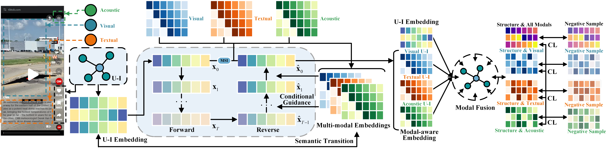
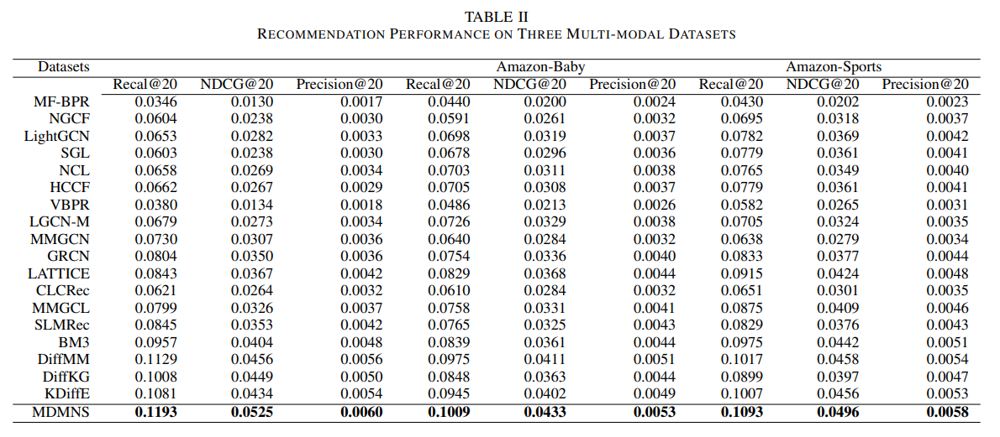
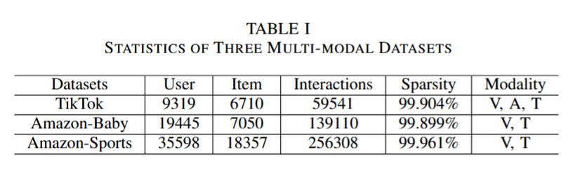

# MDMNS: Modal-aware Diffusion-enhanced with Multi-level Negative Sampling for Multimodal-based Recommendation



## 📝 Environment

We develop our codes in the following environment:

- python==3.9.13
- numpy==1.23.1
- torch==1.11.0
- scipy==1.9.1

## 🎯 Experimental Results

Performance comparison of baselines on different datasets in terms of Recall@20, NDCG@20 and Precision@20:



## 🚀 How to run the codes

The command lines to train MDMNS on the three datasets are as below. The un-specified hyperparameters in the commands are set as default.

**! If you want to run the codes on baby or sports dataset, please firstly follow the instrcution in ./Datasets** 

- TikTok

```python
python Main.py --data tiktok --reg 1e-4 --ssl_reg 1e-2 --epoch 50 --trans 1 --e_loss 0.1 --cl_method 1 --latdim 512 --gnn_layer 1 --temp 0.5 --steps 5
```

- Baby

```python
python Main.py --data baby --reg 1e-5 --ssl_reg 1e-1 --keepRate 1 --e_loss 0.01 --gnn_layer 2 --latdim 256 --temp 0.5 --steps 20
```

- Sports

```python
python Main.py --data sports --reg 1e-6 --ssl_reg 1e-2 --temp 0.1 --ris_lambda 0.1 --e_loss 0.5 --keepRate 1 --trans 1 --gnn_layer 1 --latdim 256 --temp 0.1 --steps 5
```

## 👉 Code Structure

```
.
├── README.md
├── Main.py
├── Model.py
├── Params.py
├── DataHandler.py
├── Utils
│   ├── TimeLogger.py
│   └── Utils.py
├── figures
│   ├── model.png
│   ├── dataset.png
│   └── performance.png
└── Datasets
    ├── tiktok
    │   ├── trnMat.pkl
    │   ├── tstMat.pkl
    │   ├── valMat.pkl
    │   ├── audio_feat.npy
    │   ├── image_feat.npy
    │   └── text_feat.npy
    ├── baby
    │   ├── trnMat.pkl
    │   ├── tstMat.pkl
    │   ├── valMat.pkl
    │   ├── text_feat.npy
    │   └── image_feat.npy.zip
    └── README.md
```

## 📚 Datasets


